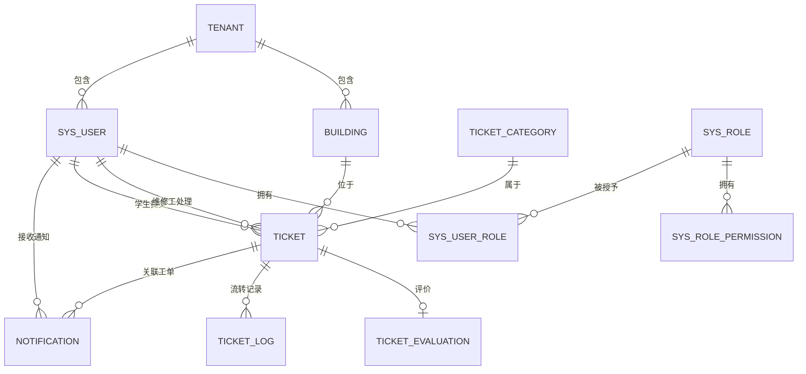

# 02 · 数据库设计文档

> 拷贝到 `docs/02-数据库设计.md`
> **这是面试最爱问的文档。** 面试官会指着某张表问"为什么这么设计""为什么加这个索引"，你必须答得出来。

---

## 1. 设计约定

| 项 | 约定 |
|---|---|
| 字符集 | `utf8mb4` / `utf8mb4_unicode_ci` |
| 主键 | `bigint` 雪花 ID（不用自增，避免分库分表和迁移问题） |
| 逻辑删除 | `deleted tinyint default 0` |
| 审计字段 | `create_time` / `update_time` / `create_by` / `update_by` |
| 金额 | `decimal(10,2)`，**绝不用 float** |
| 状态 | `tinyint` + 枚举类，字段注释写清取值含义 |
| 索引命名 | `idx_表_字段` / `uk_表_字段` |
| 外键 | **不使用物理外键**，由应用层保证（理由见 ADR） |

---

## 2. ER 图



> 用 mermaid 写，GitHub 上能直接渲染。**有图的文档和纯文字的文档，观感是两个层次。**

---

## 3. 表结构

### 3.1 `ticket` 工单主表（核心表，样例已填）

```sql
CREATE TABLE `ticket` (
  `id`              bigint       NOT NULL COMMENT '工单ID（雪花）',
  `tenant_id`       bigint       NOT NULL COMMENT '租户ID（多学校/多校区）',
  `ticket_no`       varchar(32)  NOT NULL COMMENT '工单号，展示用，如 WX20260910001',
  `student_id`      bigint       NOT NULL COMMENT '报修学生ID',
  `worker_id`       bigint       DEFAULT NULL COMMENT '维修工ID，未派单为 NULL',
  `building_id`     bigint       NOT NULL COMMENT '楼栋ID',
  `room`            varchar(32)  NOT NULL COMMENT '房间号，如 3-412',
  `category_id`     bigint       NOT NULL COMMENT '报修类别ID',
  `description`     varchar(500) DEFAULT NULL COMMENT '问题描述',
  `images`          json         DEFAULT NULL COMMENT '现场图片URL数组',
  `urgency`         tinyint      NOT NULL DEFAULT 1 COMMENT '紧急度 1普通 2紧急 3特急',
  `status`          tinyint      NOT NULL DEFAULT 10 COMMENT '状态：10待派单 20待接单 30处理中 40待验收 50已完成 60已关闭 70已撤单 80已驳回',
  `dispatch_type`   tinyint      DEFAULT NULL COMMENT '派单方式 1手动 2自动',
  `reject_reason`   varchar(255) DEFAULT NULL COMMENT '驳回理由',
  `result_desc`     varchar(500) DEFAULT NULL COMMENT '维修结果说明',
  `result_images`   json         DEFAULT NULL COMMENT '维修后照片URL数组',
  `submit_time`     datetime     NOT NULL COMMENT '提交时间',
  `dispatch_time`   datetime     DEFAULT NULL COMMENT '派单时间',
  `accept_time`     datetime     DEFAULT NULL COMMENT '接单时间',
  `arrive_time`     datetime     DEFAULT NULL COMMENT '到场时间（维修工扫报修码打卡）',
  `finish_time`     datetime     DEFAULT NULL COMMENT '完工时间',
  `close_time`      datetime     DEFAULT NULL COMMENT '关闭时间',
  `arrive_minutes`  int          DEFAULT NULL COMMENT '响应时长(分钟) = 到场时间 - 派单时间，冗余字段',
  `handle_minutes`  int          DEFAULT NULL COMMENT '处理时长(分钟) = 完工时间 - 到场时间，冗余字段',
  `deleted`         tinyint      NOT NULL DEFAULT 0 COMMENT '逻辑删除 0否 1是',
  `create_time`     datetime     NOT NULL DEFAULT CURRENT_TIMESTAMP,
  `update_time`     datetime     NOT NULL DEFAULT CURRENT_TIMESTAMP ON UPDATE CURRENT_TIMESTAMP,
  PRIMARY KEY (`id`),
  UNIQUE KEY `uk_ticket_no` (`ticket_no`),
  KEY `idx_tenant_status`  (`tenant_id`, `status`, `submit_time`),
  KEY `idx_student`        (`student_id`, `submit_time`),
  KEY `idx_worker_status`  (`worker_id`, `status`, `submit_time`),
  KEY `idx_building_time`  (`building_id`, `submit_time`)
) ENGINE=InnoDB DEFAULT CHARSET=utf8mb4
  COMMENT='维修工单主表';
```

#### ⚠️ 设计决策（**每个都要能解释，面试必问**）

| 决策 | 理由 |
|---|---|
| `status` 用 tinyint 而不是字符串 | 省空间、索引效率高；配合枚举类保证类型安全 |
| 状态值用 10/20/30 而不是 1/2/3 | 预留中间状态插入空间，避免以后加状态要改数据 |
| 冗余 `arrive_minutes` / `handle_minutes` | 看板按小时/天聚合时避免每次实时计算，是**用空间换统计性能**。响应时长定义为「到场时间 − 派单时间」而不是「接单时间 − 派单时间」——**接单可以在地铁上点，到场才是真的到了** |
| 加 `idx_worker_status` | 维修工端最高频查询是"我的待接单/处理中工单"，这是覆盖最频繁的查询路径 |
| **不使用外键** | 外键在并发写入时会产生额外锁、影响性能；且分库分表后无法维护。改为应用层 + 索引保证 |
| `images` 用 json 而不是单独图片表 | 图片只做展示、不参与查询，拆表反而增加 join 成本 |

> 💡 **这就是数据库设计文档的真正价值**：面试官问"为什么冗余这两个字段"，你能立刻答出"空间换统计性能"。没有这份文档，你大概率答"忘了"。

### 3.2 其余表（列出字段，自行补齐说明）

| 表名 | 说明 | 关键字段 |
|---|---|---|
| `tenant` | 租户（学校/校区） | id, name, code, status |
| `sys_user` | 用户（三种角色共用） | id, tenant_id, username, password, real_name, phone, user_type |
| `sys_role` / `sys_user_role` / `sys_permission` / `sys_role_permission` | RBAC 权限 | —— |
| `building` | 楼栋 | id, tenant_id, name, area |
| `ticket_category` | 报修类别 | id, tenant_id, name, default_urgency |
| `ticket_log` | 工单流转日志（谁在什么时间把状态从 A 改成 B） | id, ticket_id, from_status, to_status, operator_id, remark, create_time |
| `ticket_evaluation` | 验收评价 | id, ticket_id, score, content, create_time |
| `worker_building` | 维修工负责的楼栋（数据权限的落点） | worker_id, building_id |
| **`notification`** | **站内通知**（工单状态变更时推送，含未读/已读） | id, tenant_id, receiver_id, type, title, content, ticket_id, is_read, create_time |

> `worker_building` 是**数据权限的物理落点**——面试官问"维修工的数据隔离怎么实现"，你答"通过这张关联表确定可见楼栋，再由 MyBatis 拦截器自动注入条件"。

---

## 4. 索引设计说明

**索引不是越多越好。** 每个索引都要能说出它服务哪条查询。

| 索引 | 服务的查询 |
|---|---|
| `uk_ticket_no` | 按工单号精确查询（学生查进度） |
| `idx_tenant_status` | 后勤管理端按状态筛选 + 时间排序（最高频） |
| `idx_student` | 学生端"我的工单" |
| `idx_worker_status` | 维修工端"我的待接工单" |
| `idx_building_time` | 看板按楼栋统计 |

**注意最左前缀原则**：`idx_tenant_status(tenant_id, status, submit_time)` 能服务 `(tenant_id)`、`(tenant_id, status)`、`(tenant_id, status, submit_time)` 三种查询，但**不能**服务单查 `status`。

---

## 5. 状态机定义

```
10 待派单 ──派单──→ 20 待接单 ──接单──→ 30 处理中 ──完工──→ 40 待验收 ──验收──→ 50 已完成
   │                   │                   │                     │
   │撤单               │驳回               │驳回                 │驳回
   ▼                   ▼                   ▼                     ▼
70 已撤单           80 已驳回（回到待派单）              50 → 60 已关闭（超时未评价自动关）
```

| 当前状态 | 允许的下一步 |
|---|---|
| 10 待派单 | 20 待接单、70 已撤单 |
| 20 待接单 | 30 处理中、80 已驳回 |
| 30 处理中 | 40 待验收、80 已驳回 |
| 40 待验收 | 50 已完成、80 已驳回 |
| 50 已完成 | 60 已关闭 |
| 60 / 70 / 80 | 终态，不可再流转 |

**为什么用状态机**：散落的 `if (status == 1) ...` 判断会随需求增长失控；状态机把"合法跃迁"收敛到一处，非法跃迁统一拒绝，且每次流转都写 `ticket_log` 可追溯。

---

## 6. 面试自检

- [ ] 为什么不用外键？
- [ ] 为什么冗余 arrive_minutes？不用冗余怎么算？响应时长为什么用"到场时间"而不是"接单时间"？
- [ ] `idx_tenant_status` 这个索引能服务哪些查询？不能服务哪些？
- [ ] 工单状态为什么用 10/20/30 而不是 1/2/3？
- [ ] 多租户隔离在哪一层做的？
- [ ] 数据权限的物理依据是哪张表？
- [ ] 如果要支持"工单量增长 100 倍"，哪里会成为瓶颈？怎么改？（→ 引出分库分表/归档）
