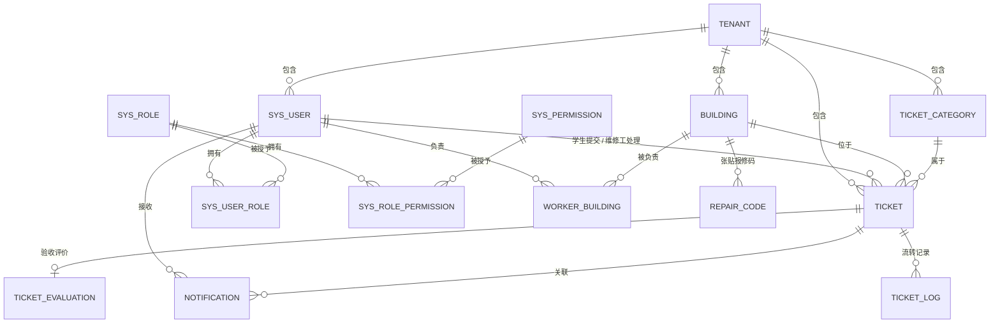

# 02 · 数据库设计文档

> 高校后勤报修 SaaS 平台的表结构、索引与状态机设计。
> 重点是**每张表为什么这么设计、每个索引为什么加**——这些理由必须能说清楚。
>
> 本文件与 `docs/schema.sql` **必须保持一致**；改动表结构时两处一起改。

---

## 1. 设计约定

| 项 | 约定 |
|---|---|
| 字符集 | `utf8mb4` / `utf8mb4_unicode_ci` |
| 主键 | `bigint` 雪花 ID（不用自增，避免分库分表和迁移问题） |
| 逻辑删除 | `deleted tinyint default 0` |
| 审计字段 | `create_time` / `update_time`（业务主表带 `deleted`；关联表与追加型表见各表说明） |
| 金额 | `decimal(10,2)`，**绝不用 float** |
| 状态 | `tinyint` + 枚举类，字段注释写清取值含义 |
| 索引命名 | `idx_*` / `uk_*`，索引名在表内唯一即可（MySQL 索引名本就是表内作用域） |
| 外键 | **不使用物理外键**，由应用层保证（理由见 ADR） |

> **为什么审计字段不带 `create_by` / `update_by`**：操作人已经从 `ticket_log`（工单流转）和 traceId 日志里能追到，通用表再各加两列属于重复存储，且大部分基础数据（楼栋、类别）的维护人信息没有查询场景。**按需冗余，不做"每张表都加全"的对称设计。**

---

## 2. ER 图



> 用 mermaid 写，GitHub 上能直接渲染。**有图的文档和纯文字的文档，观感是两个层次。**

---

## 3. 表结构

共 14 张表。`ticket` 是核心表，展开写；其余按模块分组说明。

### 3.1 `ticket` 工单主表（核心表）

```sql
CREATE TABLE `ticket` (
  `id`              bigint       NOT NULL COMMENT '工单ID（雪花）',
  `tenant_id`       bigint       NOT NULL COMMENT '租户ID（多学校/多校区）',
  `ticket_no`       varchar(32)  NOT NULL COMMENT '工单号，展示用，如 WX20260910001',
  `student_id`      bigint       NOT NULL COMMENT '报修学生ID',
  `worker_id`       bigint       DEFAULT NULL COMMENT '维修工ID，未派单为 NULL',
  `building_id`     bigint       NOT NULL COMMENT '楼栋ID',
  `room`            varchar(32)  NOT NULL COMMENT '房间号，如 3-412',
  `category_id`     bigint       NOT NULL COMMENT '报修类别ID',
  `description`     varchar(500) DEFAULT NULL COMMENT '问题描述',
  `images`          json         DEFAULT NULL COMMENT '现场图片URL数组',
  `urgency`         tinyint      NOT NULL DEFAULT 1 COMMENT '紧急度 1普通 2紧急 3特急',
  `status`          tinyint      NOT NULL DEFAULT 10 COMMENT '状态：10待派单 20待接单 30处理中 40待验收 50已完成 60已关闭 70已撤单 80已驳回',
  `dispatch_type`   tinyint      DEFAULT NULL COMMENT '派单方式 1手动 2自动',
  `reject_reason`   varchar(255) DEFAULT NULL COMMENT '驳回理由',
  `result_desc`     varchar(500) DEFAULT NULL COMMENT '维修结果说明',
  `result_images`   json         DEFAULT NULL COMMENT '维修后照片URL数组',
  `submit_time`     datetime     NOT NULL COMMENT '提交时间',
  `dispatch_time`   datetime     DEFAULT NULL COMMENT '派单时间',
  `accept_time`     datetime     DEFAULT NULL COMMENT '接单时间',
  `arrive_time`     datetime     DEFAULT NULL COMMENT '到场时间（维修工扫报修码打卡）',
  `finish_time`     datetime     DEFAULT NULL COMMENT '完工时间',
  `close_time`      datetime     DEFAULT NULL COMMENT '关闭时间',
  `arrive_minutes`  int          DEFAULT NULL COMMENT '响应时长(分钟) = 到场时间 - 派单时间，冗余字段',
  `handle_minutes`  int          DEFAULT NULL COMMENT '处理时长(分钟) = 完工时间 - 到场时间，冗余字段',
  `deleted`         tinyint      NOT NULL DEFAULT 0 COMMENT '逻辑删除 0否 1是',
  `create_time`     datetime     NOT NULL DEFAULT CURRENT_TIMESTAMP,
  `update_time`     datetime     NOT NULL DEFAULT CURRENT_TIMESTAMP ON UPDATE CURRENT_TIMESTAMP,
  PRIMARY KEY (`id`),
  UNIQUE KEY `uk_ticket_no` (`ticket_no`),
  KEY `idx_tenant_status`  (`tenant_id`, `status`, `submit_time`),
  KEY `idx_student`        (`student_id`, `submit_time`),
  KEY `idx_worker_status`  (`worker_id`, `status`, `submit_time`),
  KEY `idx_building_time`  (`building_id`, `submit_time`)
) ENGINE=InnoDB DEFAULT CHARSET=utf8mb4
  COMMENT='维修工单主表';
```

#### ⚠️ 设计决策（每个都要能解释）

| 决策 | 理由 |
|---|---|
| `status` 用 tinyint 而不是字符串 | 省空间、索引效率高；配合枚举类保证类型安全 |
| 状态值用 10/20/30 而不是 1/2/3 | 预留中间状态插入空间，避免以后加状态要改数据 |
| 冗余 `arrive_minutes` / `handle_minutes` | 看板按小时/天聚合时避免每次实时计算，是**用空间换统计性能**。响应时长定义为「到场时间 − 派单时间」而不是「接单时间 − 派单时间」——**接单可以在地铁上点，到场才是真的到了** |
| 加 `idx_worker_status` | 维修工端最高频查询是"我的待接单/处理中工单"，这是覆盖最频繁的查询路径 |
| **不使用外键** | 外键在并发写入时会产生额外锁、影响性能；且分库分表后无法维护。改为应用层 + 索引保证 |
| `images` 用 json 而不是单独图片表 | 图片只做展示、不参与查询，拆表反而增加 join 成本 |
| `worker_id` 允许为 NULL | 待派单状态下没有维修工；用 NULL 而不是 0，因为 0 是一个合法但无意义的 ID，容易在 join 时产生"幽灵记录" |
| 三个时间字段（受理/到场/完工）独立存 | 状态机只能表达"现在在哪一步"，表达不了"每一步花了多久"；统计需要的是时长，所以时间戳必须分别落库 |

### 3.2 租户与权限（6 张表）

#### `tenant` 租户

| 字段 | 类型 | 说明 |
|---|---|---|
| id | bigint | 主键 |
| name | varchar(64) | 租户名称，如「广东海洋大学」 |
| code | varchar(32) | 租户编码，**登录时用于定位租户**，唯一 |
| contact / phone | varchar(32) / varchar(20) | 联系人、联系电话 |
| status | tinyint | 1启用 0停用 |
| deleted / create_time / update_time | —— | 审计字段 |

**设计说明**：`code` 是登录参数的一部分（登录要传 `tenantCode`），因为用户名（学号/工号）只在租户内唯一，全校范围内可能重名。唯一索引用 `uk_code`。

#### `sys_user` 用户（三种角色共用）

| 字段 | 类型 | 说明 |
|---|---|---|
| id | bigint | 主键 |
| tenant_id | bigint | 租户ID |
| username | varchar(32) | 登录名（学生用学号、维修工用工号） |
| password | varchar(100) | BCrypt 加密后的密码，**绝不存明文** |
| real_name / phone | varchar(32) / varchar(20) | 姓名、手机号 |
| user_type | tinyint | 1学生 2维修工 3后勤管理 |
| status | tinyint | 1启用 0停用 |
| deleted / create_time / update_time | —— | 审计字段 |

索引：`uk_tenant_username(tenant_id, username)`、`idx_tenant_type(tenant_id, user_type)`。

**设计说明**：三种角色**共用一张表**，靠 `user_type` 区分。不拆三张表的理由是登录逻辑、密码校验、token 管理完全一致，拆表只会产生三份重复代码；差异化的权限走 `sys_role`。

#### `sys_role` 角色 / `sys_permission` 权限点

| 表 | 关键字段 | 说明 |
|---|---|---|
| `sys_role` | id, tenant_id, code, name, description, status, deleted, 审计 | `tenant_id = 0` 表示**平台内置角色**（所有租户共用）；唯一键 `uk_tenant_code(tenant_id, code)` |
| `sys_permission` | id, code, name, type, parent_id, sort, status, 审计 | 权限是**全局的**（不区分租户）；`type` 1菜单 2按钮/接口；`code` 形如 `ticket:dispatch` |

**设计说明**：权限点不做租户隔离——功能本身是平台定义的，租户能决定的只是"给哪个角色"。这避免了每个租户都要复制一份权限表。`parent_id` 预留树形层级，当前 20 个权限点都是叶子节点。

#### `sys_user_role` / `sys_role_permission` 关联表

| 表 | 字段 | 索引 |
|---|---|---|
| `sys_user_role` | id, user_id, role_id | `uk_user_role(user_id, role_id)`、`idx_role(role_id)` |
| `sys_role_permission` | id, role_id, permission_id | `uk_role_permission(role_id, permission_id)`、`idx_permission(permission_id)` |

**设计说明**：这两张是**纯关联表**，不带审计字段和逻辑删除——授权关系被删除就是删除，没有"逻辑删除后还要查历史"的场景，加 `deleted` 反而会让所有查询都要带过滤条件。唯一索引除了防重复，也顺带服务了"查某用户的角色""查某角色的权限"这两条最高频的鉴权查询；反向索引（`idx_role` / `idx_permission`）服务"某角色下有哪些用户""某权限授给了哪些角色"。

### 3.3 基础数据（4 张表）

#### `building` 楼栋 / `ticket_category` 报修类别

| 表 | 字段 | 说明 |
|---|---|---|
| `building` | id, tenant_id, name, area, sort, status, deleted, 审计 | `idx_tenant(tenant_id, status)` |
| `ticket_category` | id, tenant_id, name, default_urgency, sort, status, deleted, 审计 | `idx_tenant(tenant_id, status)` |

**设计说明**：两张表结构几乎一样，都是**租户内的字典数据**，各自带 `status` + `deleted`——下线一个楼栋或类别时，历史工单仍要能查到它的名字，所以用逻辑删除而不是物理删除。`ticket_category.default_urgency` 让"水电"默认紧急、"家具"默认普通，减少学生填写负担。

#### `worker_building` 维修工负责的楼栋 ⭐

| 字段 | 类型 | 说明 |
|---|---|---|
| id | bigint | 主键 |
| tenant_id | bigint | 租户ID |
| worker_id | bigint | 维修工用户ID |
| building_id | bigint | 楼栋ID |
| create_time | datetime | 创建时间 |

索引：`uk_worker_building(worker_id, building_id)`、`idx_building(building_id)`。

**设计说明**：这张表是**数据权限的物理落点**。维修工的数据隔离就靠它实现：先由这张表确定可见楼栋，再由 MyBatis 拦截器自动把 `building_id in (...)` 注入到 SQL 中。它不带 `deleted`——解除负责关系就是删行，`uk_worker_building` 保证不会重复授权。

#### `repair_code` 报修码（房间位置码）

| 字段 | 类型 | 说明 |
|---|---|---|
| id | bigint | 主键 |
| tenant_id | bigint | 租户ID |
| code | varchar(16) | 报修码，**租户内唯一**，扫码 / 手输用 |
| building_id | bigint | 楼栋ID |
| room | varchar(32) | 房间号，如 `3-412` |
| status | tinyint | 1启用 0停用 |
| deleted / create_time / update_time | —— | 审计字段 |

索引：`uk_code(tenant_id, code)`、`idx_room(tenant_id, building_id, room)`、`idx_building(building_id, status)`。

**设计说明**：这张表是"扫码报修 / 扫码到场"的落点，**报修码是位置码，不是工单码**——工单号（`ticket.ticket_no`）才是某一次维修的标识，二者不要混为一谈。

- `uk_code` 服务 `GET /api/tickets/by-code/{code}` 这条最高频的查询；租户维度唯一，因为调用方已登录、租户已知，同一所学校内不重复就够了，不必全局唯一。
- **「一房一码」由应用层保证，不建 `(tenant_id, building_id, room)` 唯一索引**：逻辑删除后同一房间要能重新生成码，而唯一索引会和 `deleted` 冲突（要么带着 `deleted` 一起进唯一键、产生一堆 `deleted=1` 的重复冲突，要么就永远无法重建）。`idx_room` 用于支撑应用层的那次校验查询。
- 码由管理端按需生成，**生产环境随机生成**（演示数据里的固定码仅用于本地把流程跑通）——顺序码能被枚举出全部房间，等于泄露了房间清单。
- 二维码的内容就是 `code` 字符串本身，前端用 qrcode 库渲染成图即可打印张贴。**打印是学校的一次性运维动作，不是应用的运行依赖。**

### 3.4 工单流转（2 张表）

#### `ticket_log` 工单流转日志

| 字段 | 类型 | 说明 |
|---|---|---|
| id | bigint | 主键 |
| tenant_id | bigint | 租户ID |
| ticket_id | bigint | 工单ID |
| from_status | tinyint | 变更前状态，首次创建为 NULL |
| to_status | tinyint | 变更后状态 |
| action | varchar(32) | 动作，如 DISPATCH / ACCEPT / ARRIVE / FINISH |
| operator_id | bigint | 操作人ID |
| remark | varchar(255) | 备注 |
| create_time | datetime | 创建时间 |

索引：`idx_ticket(ticket_id, create_time)`。

**设计说明**：这是**追加型（append-only）表**，只有 `create_time` 没有 `update_time` / `deleted`——日志一旦写入就不会修改。"工单详情里的流转时间线"和"每一步耗时多久"都从这张表出，不需要在 `ticket` 上再加字段。

#### `ticket_evaluation` 验收评价

| 字段 | 类型 | 说明 |
|---|---|---|
| id | bigint | 主键 |
| tenant_id | bigint | 租户ID |
| ticket_id | bigint | 工单ID |
| student_id | bigint | 评价人（学生）ID |
| score | tinyint | 评分 1-5 |
| content | varchar(500) | 评价内容 |
| create_time | datetime | 创建时间 |

索引：`uk_ticket(ticket_id)`、`idx_student(student_id)`。

**设计说明**：`uk_ticket` 唯一索引是**评价幂等的兜底**——即使应用层的状态校验被并发绕过，数据库也不会写入第二条评价。同样是追加型表，不带 `update_time` / `deleted`；评价提交后不允许修改，避免"先差评再改好评"的扯皮。

### 3.5 站内通知（1 张表）

#### `notification`

| 字段 | 类型 | 说明 |
|---|---|---|
| id | bigint | 主键 |
| tenant_id | bigint | 租户ID |
| receiver_id | bigint | 接收人用户ID |
| type | varchar(32) | 通知类型，如 TICKET_DISPATCHED / TICKET_ACCEPTED |
| title | varchar(64) | 标题 |
| content | varchar(255) | 内容 |
| ticket_id | bigint | 关联工单ID，可空 |
| is_read | tinyint | 0未读 1已读 |
| create_time | datetime | 创建时间 |

索引：`idx_receiver_read(receiver_id, is_read, create_time)`。

**设计说明**：前端最高频的查询是"我的未读数"和"我的通知列表（按时间倒序）"，所以索引把 `receiver_id, is_read` 放前面、`create_time` 放最后，一个索引同时服务这两条查询。通知是**只增不改的流水**，唯一会变的是 `is_read`；不带 `deleted`（用户删除通知本期不做）。

---

## 4. 索引设计说明

**索引不是越多越好。** 每个索引都要能说出它服务哪条查询。

| 索引 | 服务的查询 |
|---|---|
| `uk_ticket_no` | 按工单号精确查询（学生查进度） |
| `idx_tenant_status` | 后勤管理端按状态筛选 + 时间排序（最高频） |
| `idx_student` | 学生端"我的工单" |
| `idx_worker_status` | 维修工端"我的待接工单" |
| `idx_building_time` | 看板按楼栋统计 |
| `uk_code`（repair_code） | 扫报修码定位房间（`by-code` 接口） |
| `idx_room`（repair_code） | 应用层校验"该房间是否已有报修码" |
| `idx_receiver_read` | 通知的未读数与通知列表 |
| `idx_ticket`（ticket_log） | 工单详情里的流转时间线 |
| `uk_ticket`（ticket_evaluation） | 评价幂等兜底 + 按工单查评价 |

**注意最左前缀原则**：`idx_tenant_status(tenant_id, status, submit_time)` 能服务 `(tenant_id)`、`(tenant_id, status)`、`(tenant_id, status, submit_time)` 三种查询，但**不能**服务单查 `status`。

**为什么 `ticket` 上不建 `idx_category`**：类别分布统计（"哪个类别报修最多"）是低频的后台报表查询，且带时间范围过滤，实际走 `idx_tenant_status` 或按时间扫描后再聚合更划算；为它单独建索引的维护成本大于收益。

---

## 5. 状态机定义

```
10 待派单 ──派单──→ 20 待接单 ──接单──→ 30 处理中 ──完工──→ 40 待验收 ──验收──→ 50 已完成
   │                   │                   │                     │
   │撤单               │驳回               │驳回                 │驳回
   ▼                   ▼                   ▼                     ▼
70 已撤单           80 已驳回（回到待派单）              50 → 60 已关闭（超时未评价自动关）
```

| 当前状态 | 允许的下一步 |
|---|---|
| 10 待派单 | 20 待接单、70 已撤单 |
| 20 待接单 | 30 处理中、80 已驳回 |
| 30 处理中 | 40 待验收、80 已驳回 |
| 40 待验收 | 50 已完成、80 已驳回 |
| 50 已完成 | 60 已关闭 |
| 80 已驳回 | 20 待接单（后勤重新派单，清空原维修工；驳回到重新派单之间全程留痕） |
| 60 / 70 | 终态，不可再流转 |

> **到场（`arrive_time`）不改变状态**：到场发生在"30 处理中"期间，只记录时间戳，不是一次状态跃迁（`30 → 30`）。它单独记一笔 `ticket_log`（action = ARRIVE），因为响应时长的统计依赖它。
>
> **驳回回到哪**：早期版本写"80 已驳回（回到待派单）"又把 80 列为终态，自相矛盾。定稿：驳回 → 80，后勤可从 80 重新派单（80 → 20）——比直接回 10 多留一条"被驳回过"的痕迹，且全程可追溯。
>
> **50 → 60 的两种触发**：人工关闭（action = `CLOSE`，后勤操作）与超时自动关闭（action = `AUTO_CLOSE`，操作者 = 0 系统，由超时调度触发——50 已完成超过验收阈值未人工关闭，默认 24h）。两者在 `ticket_log` 上可区分，统计"人工关闭 vs 超时关闭"时按 action 过滤。
>
> **超时提醒/升级也不是状态跃迁**：三个节点都只记日志 + 发通知，不改状态——
> ① `ACCEPT_TIMEOUT`：20 待接单 超过接单阈值（默认 24h，基准 `dispatch_time`）提醒后勤管理员；
> ② `PROCESS_TIMEOUT`：30 处理中 自派单起超过处理阈值（默认 48h，基准同为 `dispatch_time`）升级提醒；
> ③ 50 已完成 超过验收阈值（默认 24h）则由 `AUTO_CLOSE` 自动流转 60（这是唯一会改状态的超时动作）。
> 三种动作操作者都 = 0（系统）。**同一工单同一节点只触发一次**，判重依据就是那笔 `ticket_log`——
> 兜底扫描每分钟都会扫到同一批超期工单，没有判重会把管理员刷屏。

> **租户是第一层数据边界**（ADR-008）：所有列表/详情/更新都由拦截器先注入 `tenant_id = 当前登录者的租户`，
> 再按角色追加条件（学生=本人 / 维修工=负责楼栋 / 后勤=本租户内不限）。**无登录态的系统上下文（定时任务）不注入**，
> 这是超时兜底扫描能跨租户处理的前提。

**为什么用状态机**：散落的 `if (status == 1) ...` 判断会随需求增长失控；状态机把"合法跃迁"收敛到一处，非法跃迁统一拒绝，且每次流转都写 `ticket_log` 可追溯。

---

## 6. 设计问答

- [ ] 为什么不用外键？
- [ ] 为什么冗余 arrive_minutes？不用冗余怎么算？响应时长为什么用"到场时间"而不是"接单时间"？
- [ ] `idx_tenant_status` 这个索引能服务哪些查询？不能服务哪些？
- [ ] 工单状态为什么用 10/20/30 而不是 1/2/3？
- [ ] 多租户隔离在哪一层做的？
- [ ] 数据权限的物理依据是哪张表？
- [ ] 为什么三种角色共用一张 `sys_user`，而关联表不带 `deleted`？
- [ ] 审计字段为什么没有 `create_by` / `update_by`？
- [ ] `ticket_evaluation` 的 `uk_ticket` 唯一索引除了防重复，还有什么用？
- [ ] 报修码为什么单独建表，而不是拿房间号当标识？为什么不给 `(楼栋, 房间)` 建唯一索引？报修码和工单号的区别是什么？
- [ ] 如果要支持"工单量增长 100 倍"，哪里会成为瓶颈？怎么改？（→ 引出分库分表/归档）
