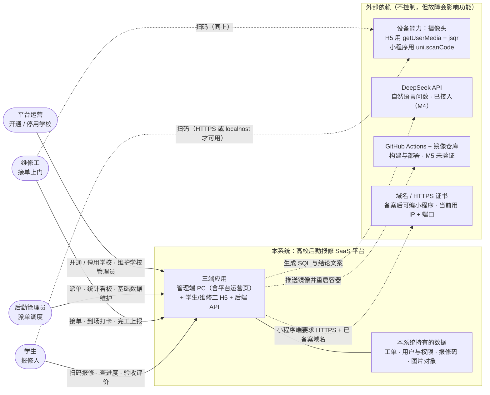
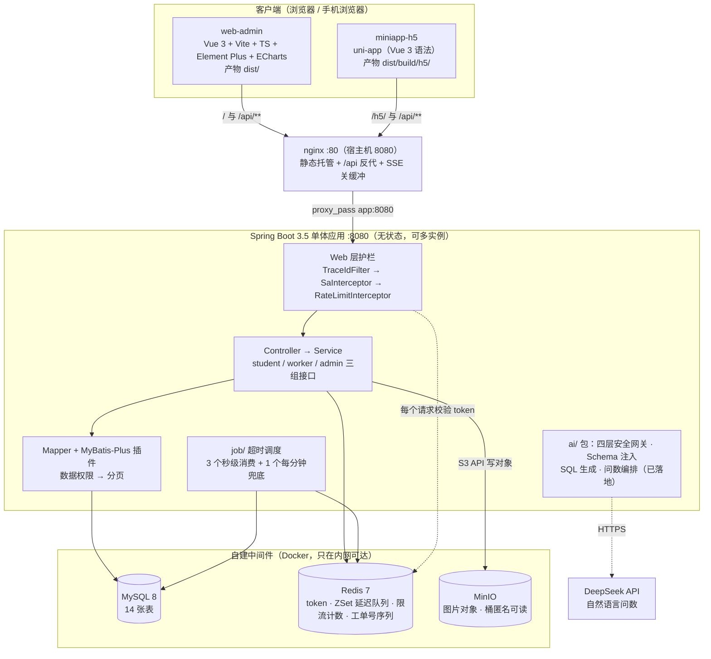
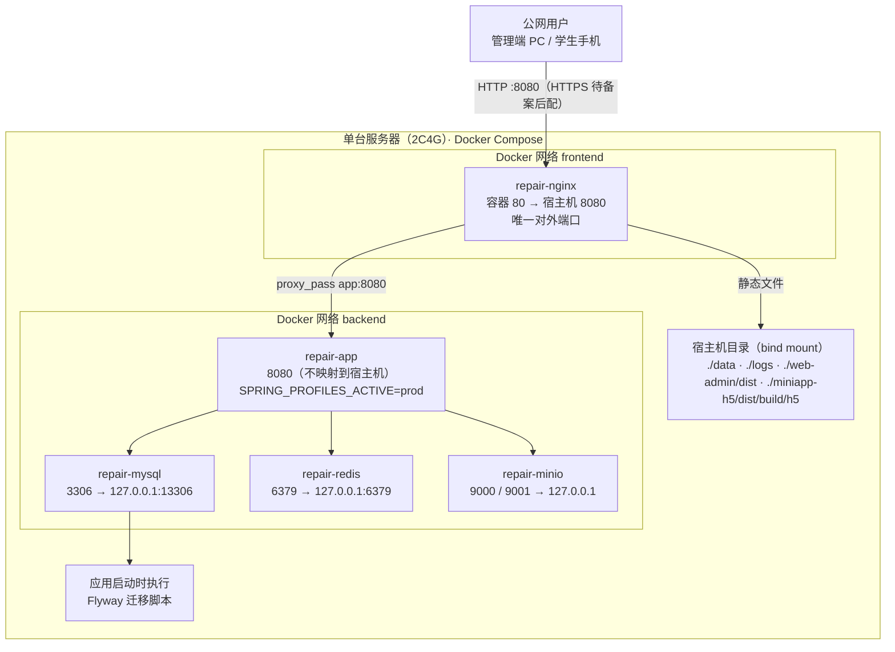
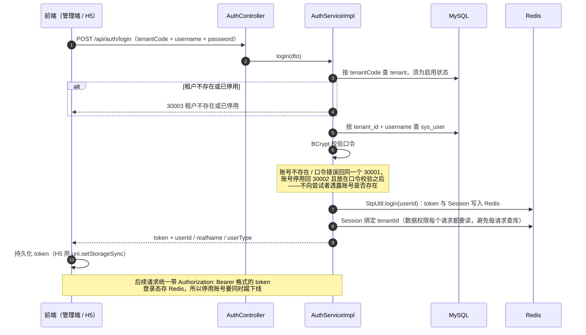
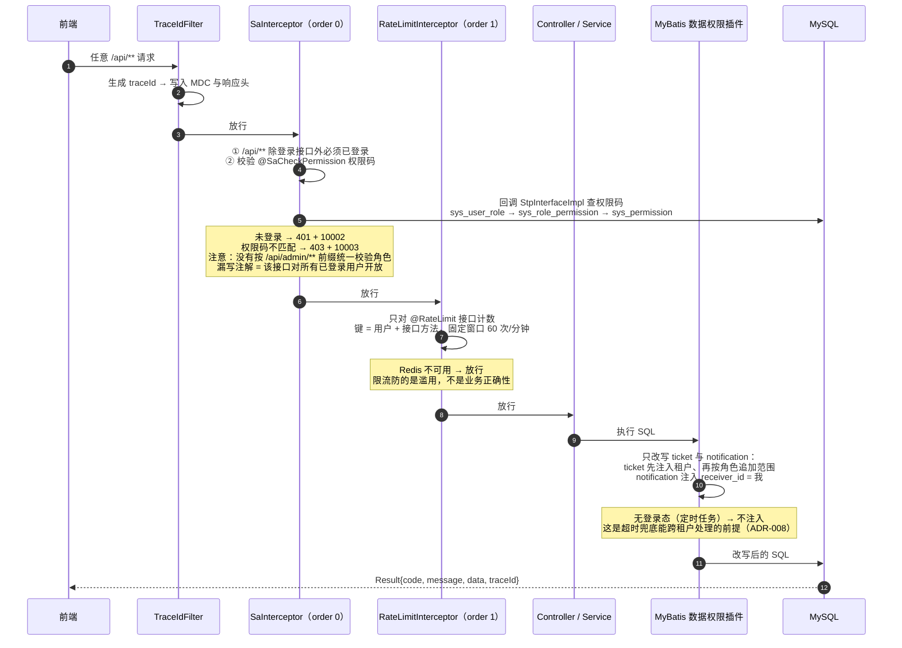
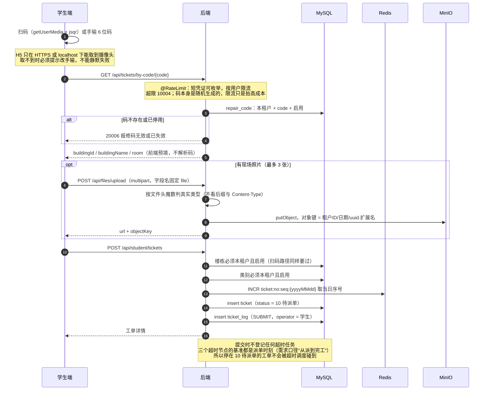
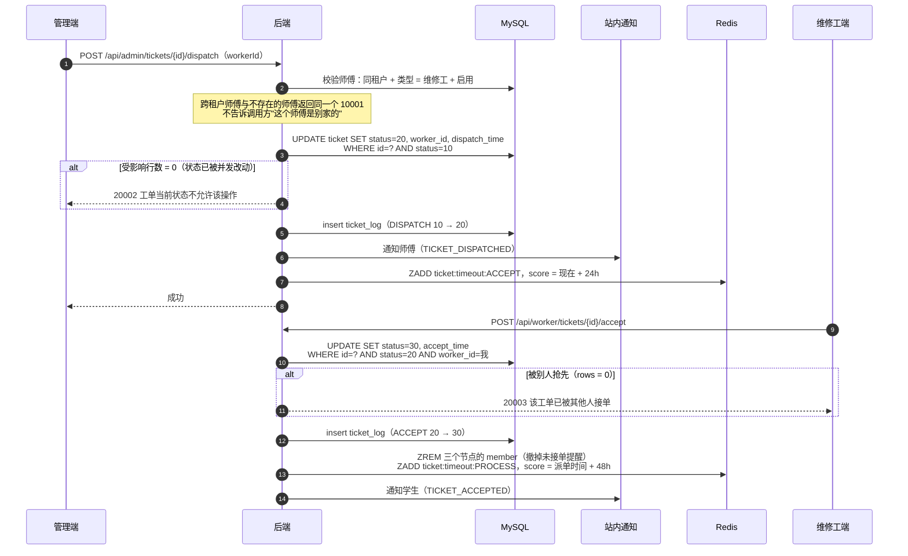
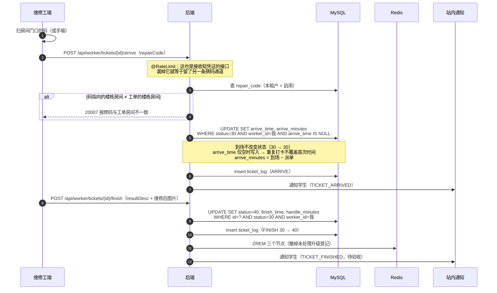
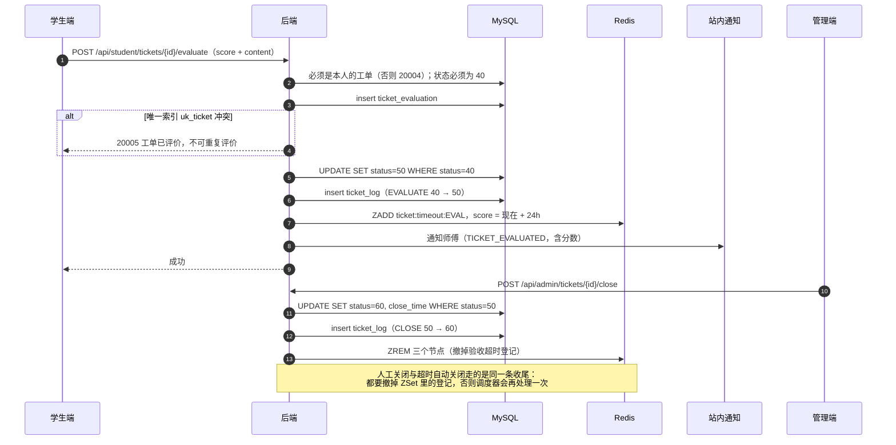
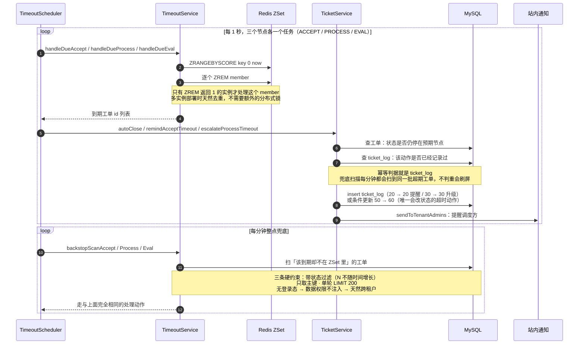

# 06 · 架构图（Mermaid）

> **这份文档解决什么问题**：读懂系统"长什么样、请求怎么走"。
> `docs/01~05` 是**契约**（规定"必须是什么"），本文件是**视图**（描述"现在实际是什么样"）——
> 图里出现与文字文档不一致的地方，以文字文档为准，并回来改图。
>
> **为什么用 Mermaid**：图是文本，能进 Git、能走 review、能和代码在同一个提交里改；
> 用截图或画图工具存的图，三个月后没人敢动，因为不知道改了哪里。
>
> **图的取舍**：只用 `flowchart` / `sequenceDiagram` / `erDiagram` 三种 GitHub 原生渲染的类型。
> Mermaid 的 `C4Context` 语法在部分渲染器上支持不完整，会出现"本地能看、GitHub 上空白"，
> 所以 C4 的分层用 `flowchart` + `subgraph` 表达，语义等价、渲染稳定。
>
> 每张图的**事实来源**都写在图下面，改代码时按那一行找到对应文档改。

| 图 | 回答的问题 | 事实来源 |
|---|---|---|
| §1 系统上下文图 | 边界在哪、谁在用、依赖了谁 | `docs/01` §角色、`docs/04` ADR-003/005 |
| §2 容器图 | 有几个进程、各是什么技术、谁连谁 | `pom.xml`、两个前端的 `package.json`、`application.yml` |
| §3 部署图 | 怎么落到一台机器上、端口怎么映射 | `docker-compose.yml`、`nginx/nginx.conf`、`docs/05` |
| §4 时序图 | 一条业务从哪进、在哪些地方改了什么 | `TicketServiceImpl`、`TimeoutServiceImpl`、`docs/03` |
| ER 图 | 表之间怎么关联 | **不在本文件**，见 `docs/02-数据库设计.md` §2 |

---

## 1. 系统上下文图（C4 Level 1）

**边界**：框内是本项目自己开发、自己部署的部分；框外是我们依赖但不控制的东西。

**边界里明确没有什么**（避免"以后要不要加"的反复讨论，理由见 `docs/01` §5 与 `AGENTS.md` §9）：

- **不接微信授权登录、不接微信订阅消息 / 短信 / 邮件**：这些只在某一种端上有，会破坏"一套代码编 H5 也能编小程序"的跨端前提；通知一律走站内通知。
- **不集成学校现有的资产 / 教务系统**：没有对接需求，`tenant` + `tenantCode` 就是多租户的全部抽象。
- **没有面向学生的自助找回口令**：不做短信 / 邮件，所以"忘记口令"的出路是找学校后勤重置（学生 / 维修工），或找平台重置（后勤管理员）。详见 ADR-012。
- **平台运营的可见范围只有"租户 + 租户的管理员"**：`sys_role.tenant_id = 0` 是平台内置角色的位置，平台运营账号（`tenant_id = 0`、`user_type = 4`）通过 `/api/platform/**` 开通 / 停用学校。它**看不到任何学校的业务数据**——这条由 `PlatformScopeInterceptor` 强制（ADR-012），不是"当前没写那些接口"。

**为什么把"设备能力"画在框外**：扫码不是后端接口，是客户端能力。`docs/03` §7.1 明确写了"二维码没有后端接口，内容就是 code 本身，前端用 qrcode 库渲染"——把它画进边界内会让人误以为后端参与了扫码。

---

## 2. 容器图（C4 Level 2）

**容器**指"能独立运行 / 独立部署的进程"。本项目是单体，所以"容器"只有 4 个进程 + 3 个中间件。

### 各容器的职责与关键约束

| 容器 | 技术 | 关键约束（写错会出什么问题） |
|---|---|---|
| `web-admin` | Vue 3 + Vite，产物 `dist/` | 只与后端通过 `/api/**` 通信；不 import 后端源码（`AGENTS.md` §3.1） |
| `miniapp-h5` | uni-app，产物 `dist/build/h5/` | 只用 `uni.*` 与 Vue（`uni.request` / `uni.getStorageSync` / `uni.uploadFile`），不引入 axios、不用 `localStorage`——否则编小程序时全部要重写 |
| `nginx` | nginx 1.27 | 唯一对外入口。图片 URL 由后端拼 `MINIO_PUBLIC_BASE_URL`，浏览器**不直连 MinIO**（9000 只绑 127.0.0.1，直连会打不开） |
| `app` | Spring Boot 3.5 + Java 17 | **无状态**：登录态在 Redis，所以可以多实例；超时调度的多实例去重靠 `ZREM` 返回值（ADR-001） |
| `mysql` | MySQL 8 | 14 张表；**不使用物理外键**，关联由应用层保证（`docs/02` §1） |
| `redis` | redis-stack-server 7.2 | 四种用途见下 |
| `minio` | MinIO（`quay.io` 镜像） | 应用启动**不依赖**它：首次上传才建客户端与桶，挂了只影响上传（返回 `50003`） |

**Redis 的四种用途**（拆开看才知道为什么它挂了不会全站不可用）：

| 用途 | Key | 不可用时的影响 |
|---|---|---|
| 登录态 | Sa-Token 自动管理 | 鉴权直接失败——这是唯一"硬依赖"（未登录回 401 + `10002`，Redis 异常回 500 + `10005`） |
| 延迟队列 | `ticket:timeout:{ACCEPT\|PROCESS\|EVAL}` | 秒级触发失效，由每分钟兜底扫描接管 |
| 限流计数 | 按「用户 + 接口」 | **放行**，不拦业务（ADR-009） |
| 工单号序列 | `ticket:no:seq:{yyyyMMdd}` | 取号失败即提交失败；`uk_ticket_no` 是兜底唯一约束 |

**M4 的位置**：`ai/` 包已落地——四层安全网关、Schema 注入、模型接入（LangChain4j + DeepSeek）、问数编排、`POST /api/ai/query` 与管理端「AI 问数」页都在。**只有流式（`/api/ai/query/stream`）还没做**，图里与流式相关的部分是计划态。

---

## 3. 部署图（单机 Docker Compose）

> **状态：工件齐、公网已验证（M5 部分完成）**。`docker-compose.yml`、`Dockerfile`、`nginx/nginx.conf`、`docs/05` 都已就绪，
> 演示站 <http://119.91.47.63:8080> 跑在 2C2G 腾讯云轻量上（管理端与 `/h5/` 都在），下面这张图与现网一致。
> **仍未验证的是 CD 的 push 自动部署**——服务器连不上 GitHub，目前的发布路径是本地打包 → 上传 → 解包 → 重建（见 `docs/05` §4.2）。
> 之所以还是画出来：它是 `/h5/` 只能挂 `dist/build/h5/`、MySQL 宿主机端口是 13306 这类**容易记错**的信息的集中落点。
> 运维步骤（服务器初始化、备份、排查命令）**不在这里重复**，看 `docs/05-部署文档.md`。

### 端口与路径映射（照抄 `docker-compose.yml` 与 `nginx/nginx.conf`）

| 服务 | 容器名 | 容器内 | 宿主机绑定 | 谁能访问 |
|---|---|---|---|---|
| nginx | `repair-nginx` | 80 | `0.0.0.0:8080` | 公网 |
| app | `repair-app` | 8080 | 不映射 | 仅 nginx（走容器网络） |
| mysql | `repair-mysql` | 3306 | `127.0.0.1:13306` | 仅本机（IDEA 连它调试） |
| redis | `repair-redis` | 6379 | `127.0.0.1:6379` | 仅本机 |
| minio | `repair-minio` | 9000 / 9001 | `127.0.0.1:9000` / `9001` | 仅本机 |

| nginx location | 去处 | 备注 |
|---|---|---|
| `/` | `web-admin/dist` | `try_files ... /index.html` 支撑前端 history 路由 |
| `/h5/` | `miniapp-h5/dist/build/h5` | **uni-app 的产物路径与 web-admin 不同**，写错会静默挂成空目录、表现为 403 |
| `/api/ai/query/stream` | `app:8080` | 必须 `proxy_buffering off`，否则 SSE 退化成一次性返回 |
| `/api/` | `app:8080` | 普通接口 |
| `/doc.html`、`/webjars/`、`/v3/api-docs`、`/swagger-resources/` | `app:8080` | 只转发 `/doc.html` 会白屏——页面在 HTML 里，JS/CSS 在 `/webjars/` |
| `/actuator/health` | `app:8080` | 健康检查，关日志 |

**公网这一段还没验证的事**：域名解析、HTTPS 证书（备案通过后用 Let's Encrypt）、
`MINIO_PUBLIC_BASE_URL` 改成公网域名（现在默认 `127.0.0.1:9000`，线上不改就成了"数据库里存着只有服务器自己能打开的图片地址"）。
这三件事都在 `docs/05` 的清单里，不重复。

---

## 4. 核心业务时序图

参与者统一简写：`H5` = 学生/维修工端，`AD` = 管理端，`API` = 后端，
`DB` = MySQL，`R` = Redis，`MIO` = MinIO，`N` = 站内通知。

### 4.1 登录与发令牌

**为什么 token 放 Redis 而不是 JWT**：JWT 签出去就收不回，而"停用维修工"必须立刻生效
（`docs/03` §维修工接口的约定：停用会同时让已登录 token 失效）。代价是每个请求多一次 Redis 读。

### 4.2 一次请求要过的四道护栏

这张图是理解本项目**权限模型**的关键：功能权限在 Web 层，数据权限在 MyBatis 层，两者都在框架层，新增接口默认继承。

**这条链路里最容易犯的错**：以为 `/api/admin/**` 前缀本身就是权限。前缀只是路径组织方式，
真正决定能不能调用的是方法上的 `@SaCheckPermission`——所以漏写注解的接口是**对所有已登录用户开放的**。
`docs/03` §4 把这一点写成了明文约定。

### 4.3 提交报修（扫码或手输码 → 落库）

**为什么类别、楼栋都要服务端复校**：`requireEnabledBuilding` 的注释里写了两个真实后果——
不校验直接传的 `buildingId`，能造出"后勤看得到、师傅永远看不到"的孤儿工单；
不校验扫码路径，停用楼栋就挡不住扫码报修，"停用"就成了空话。

### 4.4 派单与接单

**两个不看代码就会理解错的点**：

1. **幂等靠条件更新，不靠"先查再改"**。`WHERE status = 旧状态` 的受影响行数为 0 就是并发冲突的信号。
   这套机制不依赖单实例假设，也没有锁的获取释放成本（`docs/03` §6）。
2. **处理超时的基准是派单时间，不是接单时间**。所以 `registerProcess` 传的是 `ticket.getDispatchTime()`，
   与每分钟兜底扫描的 `dispatch_time < now - 48h` 必须完全一致——两条路径基准不同就会给出不同的到期时刻。

### 4.5 到场打卡与完工上报

**为什么要再校验一次码**：前端已经比对过一次，但"只靠前端比对等于没有校验"——
维修工完全可以不扫码、直接调接口。服务端这次校验（`REPAIR_CODE_ROOM_MISMATCH`）才是真正的门。

### 4.6 验收评价与关闭

**为什么验收要"先摆维修结果再打分、星级不预选"**：预选 5 星等于把"懒得点"的人也算成满分，
满意度数据会变假（`docs/00` §2.2）。这属于产品判断，写在这里是为了让后来者知道它不是实现疏漏。

### 4.7 超时调度与兜底

**这张图要记住的一句话**：秒级路径（ZSet）负责"准时"，分钟级路径（兜底扫描）负责"不漏"，
两条路径必须共用同一个到期基准，否则同一个工单会在两个时刻被处理两次、给出矛盾的结果。
基准的定义写在 `TimeoutServiceImpl` 的注释与 `docs/00` §3.4。

**只画不写会漏掉的坑**（都在代码注释里，这里集中一次）：

- 调度任务**不向上抛异常**，降级成一行 WARN 且同类失败只提醒一次——一个任务每秒跑一轮，
  Redis 挂掉时抛异常会按 ERROR 打整段堆栈，一天 20 多万行日志把真正的问题淹掉。
- `@Scheduled` 的线程池显式配成 4（`application.yml`）：Spring 默认池大小是 1，
  四个任务串行执行时，一次慢的兜底扫描会吃掉秒级任务的调度窗口，触发精度退化回分钟级——正是 ADR-001 要消灭的问题。

---

## 5. 图与文档的分工（防止两处漂移）

| 想改的东西 | 先改哪 | 再改哪 |
|---|---|---|
| 表结构 / 索引 | `src/main/resources/db/migration/`（Flyway 迁移脚本） | `docs/02`（含 §2 的 ER 图） |
| 接口路径 / 错误码 | `docs/03` | 代码（`ErrorCode` 枚举是错误码表的唯一代码落点） |
| 新增技术选型 | `docs/04` 写一条 ADR | 再动 `pom.xml` / `package.json` |
| 租户身份与平台 / 租户的域边界 | `docs/04` ADR-012 | `R__seed.sql`（平台租户行、PLATFORM 角色）、`PlatformScopeInterceptor` |
| 端口 / nginx 路径 / 环境变量 | `docker-compose.yml` · `nginx/nginx.conf` | `docs/05`，本文件 §3 的表格 |
| 工单状态机 | `docs/02` §5 | `docs/00` §3.2、代码里的 `TicketStatus` |

**本文件不重复定义任何契约**：状态码、错误码、超时阈值、权限码一律指向 `docs/02` / `docs/03`，
只画"这些东西怎么串起来"。所以本文件的改动频率应该远低于那两份——如果某次改动需要同时改本文件和 `docs/03`，
说明图里混进了契约，应该把它挪回 `docs/03`。
